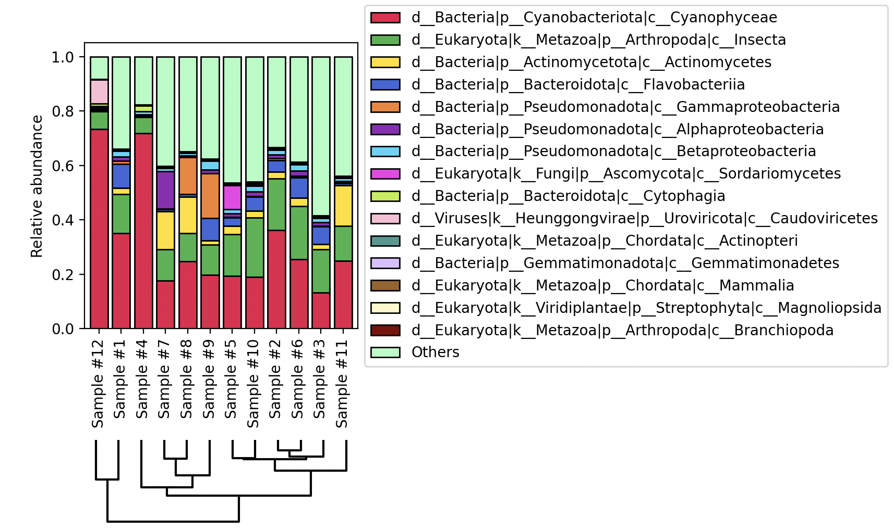

## Varied scripts for varied tasks - from file formatting to data visualization
## [kreport_mpa_barplot.py](https://github.com/dsamoht/utility/blob/main/kreport_mpa_barplot.py)
- __info__: This script can produce 2 types of stacked barplots from Kraken classification reports:  
  1. Top *n* taxa at a specific taxonomic level relative to all classified sequences (ex: barplot of top 10 phyla)
  2. Top *n* taxa at a specific taxonomic level relative to a parent taxa (ex: barplot of top 10 cyanobacterial genus inside the *Cyanobacteria* phylum)
- __input__: multiple kraken reports merged into a single table via 2 commands:  
  1. KrakenTools' kreport2mpa.py (with --intermediate-ranks parameters)
  2. KrakenTools' combine_mpa.py
- __dependencies__: pandas, matplotlib, scipy  
- __usage__:
```
python kreport_mpa_barplot.py --input [KREPORT_MPA] --barplot_relative_to_all --tax-level [p/c/o/f/g/s] --top_n [INT]
python kreport_mpa_barplot.py --input [KREPORT_MPA] --barplot_relative_to_parent --tax_name [STRING] --tax-level [p/c/o/f/g/s] --top_n [INT]
```
- __example__: Top 15 classes relative to all classified sequences



## [collapse_asv.py](https://github.com/dsamoht/utility/blob/main/collapse_asv.py)
- __dependencies__: pandas, [cdhit](https://github.com/weizhongli/cdhit)  
- __info__: This script aims to speed up DADA2's `collapseNoMismatch` by using `cd-hit-est` with 100% identity clustering. ASVs of different lengths but of 100% identity on the shorter sequence are collapsed (summed). The most abundant ASV across samples is kept as the representative.  
- __usage__:
```
python collapse_asv.py [SEQTAB] [COLLAPSED_SEQTAB]
```
- __input format__:  
[SEQTAB] must be comma-separated (ASV as column, sample as row, sample name as 1st column):  
(This format is typically the output of R write.csv() applied on a DADA2 seqtab object)
```
,CACGGA,ACACG,ATACCG,...    
sample_1,0,0,961,...    
sample_2,4,0,5,...    
sample_3,1,6,78,...    
...
```
## [fasta_sampler.py](https://github.com/dsamoht/utility/blob/main/fasta_sampler.py)
- __info__: This script samples a fasta file from a list of headers given in entry.
- __usage__:
```
python fasta_sampler.py [FASTA] [HEADERS] > [SAMPLED_FASTA]
```
- __input format__:  
[FASTA] : standard fasta  
[HEADERS] : file with 1 header of interest per line (with or without ">")
